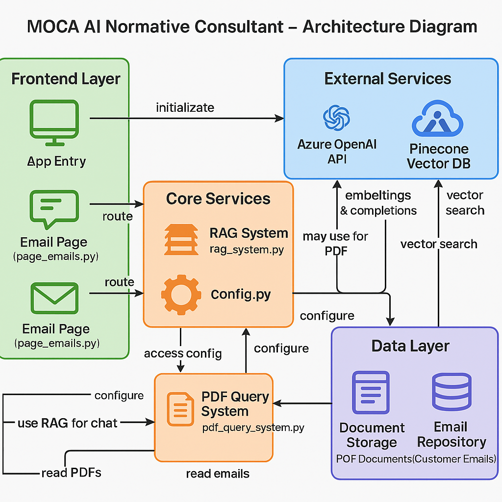

# MOCA AI Normative Consultant - Architecture Diagram

## Application Components

### Frontend Layer (Streamlit)
- **app.py**: Main entry point that initializes the app, loads resources and routes to appropriate page
- **page_chat.py**: Implements an interactive chat interface with multi-chat management and memory features
- **page_emails.py**: Provides email analysis and response generation capabilities

### Core Services
- **config.py**: Handles application configuration, environment variables and client initialization
- **rag_system.py**: Core RAG (Retrieval Augmented Generation) engine with document search and AI response generation
- **pdf_query_system.py**: Specialized system for PDF document querying and processing

### External Services
- **Azure OpenAI API**: Provides AI capabilities for chat completions and embedding generation
- **Pinecone Vector DB**: Vector database for semantic search functionality

### Data Layer
- **Document Repository**: PDF documents used as knowledge base
- **Email Repository**: Customer emails for analysis and response

## Data Flow

1. User interacts with Streamlit interface (chat or email page)
2. Request is processed by the appropriate page handler
3. The RAG system:
   - Converts user query to vector embeddings via Azure OpenAI
   - Searches relevant documents in Pinecone vector database  
   - Retrieves context-relevant information
   - Generates AI response with Azure OpenAI including retrieved context
4. Response is displayed to user in the Streamlit interface

## Key Features
- Multi-chat management with history
- Dynamic memory updates for overriding information
- Email analysis and automated response generation
- Context-aware responses from normative documents
- Document source tracking and citation
