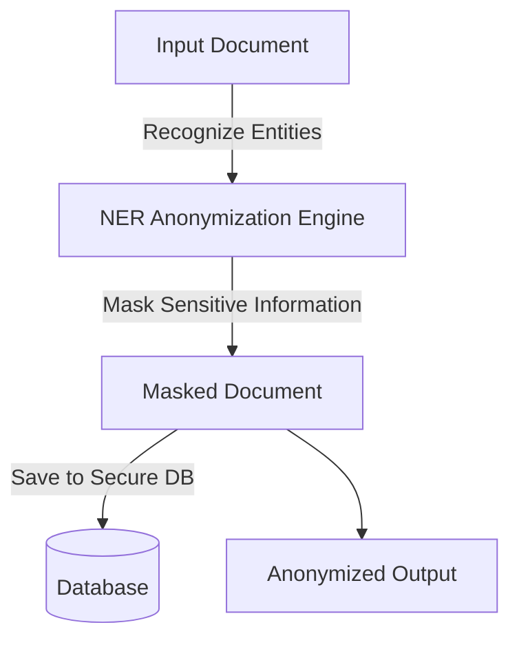
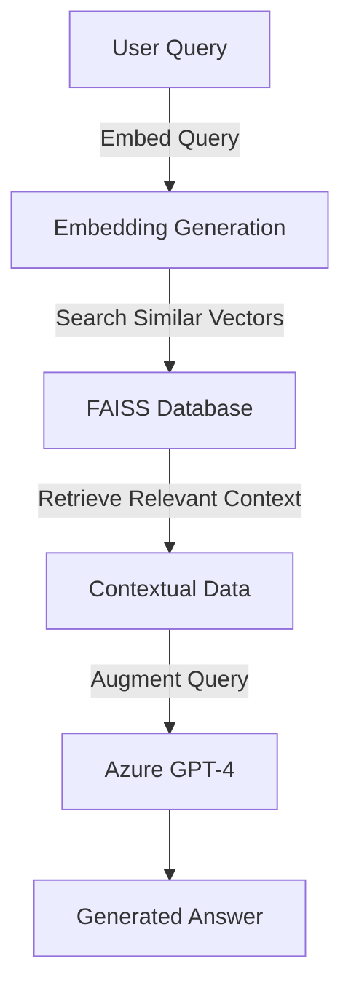
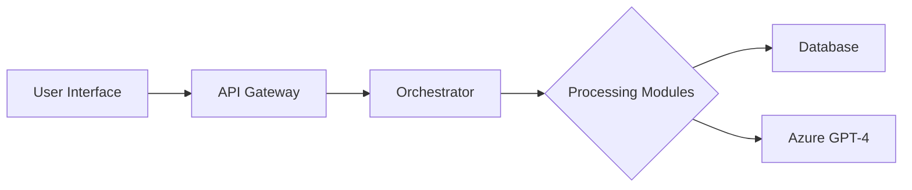

# Agentic RAG Advanced Documentation  

  
  
  
  

---

## Table of Contents  
1. [Advanced Architecture Overview](#advanced-architecture-overview)  
   - [System Architecture Diagram](#system-architecture-diagram)  
   - [Process Flow Diagrams](#process-flow-diagrams)  
   - [Component Interactions](#component-interactions)  
   - [Database Schema](#database-schema)  
2. [Specialized Guides](#specialized-guides)  
   - [DevOps Deployment Guide](#devops-deployment-guide)  
   - [Security Best Practices](#security-best-practices)  
   - [Performance Tuning](#performance-tuning)  
   - [Monitoring and Observability](#monitoring-and-observability)  
   - [Testing Strategies](#testing-strategies)  
3. [In-Depth Technical Documentation](#in-depth-technical-documentation)  
   - [Design Patterns](#design-patterns)  
   - [Architectural Decisions and Trade-Offs](#architectural-decisions-and-trade-offs)  
   - [Dependency Mapping](#dependency-mapping)  
   - [Error Handling Strategy](#error-handling-strategy)  
4. [Templates and Boilerplate](#templates-and-boilerplate)  
   - [Feature Template](#feature-template)  
   - [Example Configurations](#example-configurations)  
   - [Automation Scripts](#automation-scripts)  
   - [Docker and Kubernetes Configurations](#docker-and-kubernetes-configurations)  
5. [Governance and Processes](#governance-and-processes)  
   - [Code Review Guidelines](#code-review-guidelines)  
   - [Branch Strategy](#branch-strategy)  
   - [CI/CD Pipeline](#ci/cd-pipeline)  
   - [Release Process](#release-process)  

---

## Advanced Architecture Overview  

### System Architecture Diagram  

```mermaid
graph TD
    User[User Interface (Streamlit)] -->|Sends Requests| API[REST API Gateway]
    API -->|Processes Requests| Orchestrator[Multi-Agent Orchestrator (CrewAI)]
    Orchestrator -->|Anonymize Data| NER[NER Anonymizer Module]
    Orchestrator -->|Query GPT-4| GPT[Azure GPT-4 Processor]
    Orchestrator -->|Retrieve Data| DB[Document Vector Database (FAISS)]
    GPT --> Dashboard[Interactive Dashboard]
    DB --> GPT
    NER --> Dashboard
```

---

### Process Flow Diagrams  

#### Data Anonymization Flow  



#### Semantic Query Workflow  



---

### Component Interactions  



---

### Database Schema  

| **Table Name**      | **Description**                       | **Key Fields**             |  
|----------------------|---------------------------------------|----------------------------|  
| `documents`          | Stores uploaded and processed docs   | `doc_id`, `content`        |  
| `anonymous_entities` | Tracks anonymized entities           | `entity_id`, `doc_id`      |  
| `query_logs`         | Logs semantic queries and responses  | `query_id`, `timestamp`    |  

---

## Specialized Guides  

### DevOps Deployment Guide  

1. **Infrastructure Setup**:  
   - Provision an Azure Virtual Machine with at least **8 CPUs and 32GB RAM**.  
   - Add storage for large-scale document processing.  

2. **Install Dependencies**:  
   ```bash
   apt update && apt install -y python3.9 python3-pip docker.io
   pip install -r requirements.txt
   ```

3. **Setup Docker**:  
   Create a `Dockerfile` for local builds:  
   ```dockerfile
   FROM python:3.9-slim
   WORKDIR /app
   COPY . .
   RUN pip install -r requirements.txt
   CMD ["python", "main.py"]
   ```

4. **Deploy Using Docker Compose**:  
   ```yaml
   version: '3'
   services:
     api:
       build: .
       ports:
         - "8000:8000"
       environment:
         AZURE_KEY: "your-azure-key"
   ```  

5. **Kubernetes Deployment**: Refer to [this guide](#docker-and-kubernetes-configurations).  

---

### Security Best Practices  

- **API Keys Management**: Use Azure Managed Service Identity for secure secrets storage.  
- **Data Encryption**: Ensure TLS/SSL encryption for all API traffic.  
- **Access Control**: Implement Role-Based Access Control (RBAC) for sensitive endpoints.  

---

### Performance Tuning  

1. Optimize GPT-4 querying by using embeddings for context filtering prior to API requests.  
2. Enable multi-threading in the CrewAI orchestrator to handle concurrent tasks.  

---

### Monitoring and Observability  

- **Prometheus Integration**: Export metrics for anonymization time, query processing, and API latency.  
- **Grafana Dashboards**: Visualize real-time pipeline performance.  

---

### Testing Strategies  

1. **Unit Testing**: For individual modules (`pytest` recommended).  
2. **Integration Testing**: Simulate end-to-end document anonymization and querying.  
3. **Load Testing**: Verify performance at scale using `locust.io`.  

---

## In-Depth Technical Documentation  

### Design Patterns  

- **Pipeline Pattern**: For sequential document processing.  
- **Microservices**: Each module (NER, RAG, etc.) is stateless and deployable as an independent service.  

---

### Architectural Decisions and Trade-Offs  

- **Database Choice**: Chose FAISS for fast vector processing over traditional SQL solutions.  
- **Cloud Provider**: Azure selected for GPT-4 and machine-learning optimizations.  

---

### Dependency Mapping  

| **Dependency**   | **Version**    | **Purpose**                                |  
|-------------------|----------------|--------------------------------------------|  
| `LangChain`       | `>=0.5.0`      | RAG implementation                         |  
| `transformers`    | `>=4.10.0`     | NER and embeddings                         |  
| `faiss-cpu`       | `>=1.7.0`      | Vector search database                     |  

---

### Error Handling Strategy  

- **Retries**: Use exponential backoff for Azure API calls.  
- **Logging**: Ensure all errors are logged to a central ELK stack (Elasticsearch, Logstash, Kibana).  

---

## Templates and Boilerplate  

### Feature Template  

**Feature Name**:  
Description:  
Owner:  

---

### Example Configurations  

**Streamlit Configuration:**  
```python
[server]
headless = true
port = 8501
```

---

### Automation Scripts  

- **Deployment Automation**:  
   ```bash
   ./deploy.sh
   ```

---

### Docker and Kubernetes Configurations  

```yaml
apiVersion: apps/v1  
kind: Deployment  
metadata:
  name: agentic-rag  
spec:
  replicas: 3  
  selector:
    matchLabels:
      app: agentic-rag  
  template:
    metadata:
      labels:
        app: agentic-rag  
    spec:
      containers:
      - name: agentic-rag-api  
        image: agentic-rag:latest  
```

---

## Governance and Processes  

### Code Review Guidelines  

- Ensure all new features include unit tests.  
- Verify adherence to the PEP-8 coding standard.  

---

### Branch Strategy  

- Use **GitFlow** with `feature/`, `release/`, and `hotfix/` prefixes.  

---

### CI/CD Pipeline  

1. Automated builds on `push` events to `main`.  
2. Deploy to staging for all pull requests.  

---

### Release Process  

- Generate a changelog using conventional commits.  
- Tag releases with semantic versioning (`vX.Y.Z`).  

---