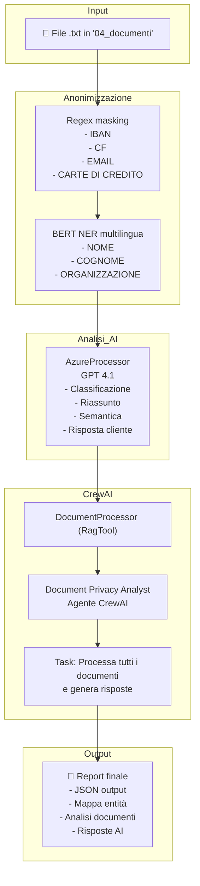

# 📐 Schema Architetturale del Progetto: Agentic RAG
 
## 🎯 Obiettivo del Sistema
 
La pipeline realizza un sistema automatizzato che:
- Legge documenti testuali contenenti dati sensibili.
- Anonimizza tali dati tramite tecniche di Named Entity Recognition (NER) e Regex.
- Analizza semanticamente il contenuto con modelli LLM (GPT via Azure OpenAI).
- Produce un report dettagliato con classificazione, sintesi e risposta automatica (se richiesta).
- Il tutto orchestrato da un agente CrewAI specializzato.
 
---
 
## 🧩 Componenti Principali
 
### 📁 Input
- Documenti `.txt` contenuti nella directory `04_documenti/`
- I file rappresentano comunicazioni, fatture, note di credito, ecc.
 
### 🔐 Anonimizzazione
- Modulo `NERAnonimizer`:
  - **Regex masking**: IBAN, email, codice fiscale, numeri carta.
  - **NER masking**: tramite modello `Davlan/bert-base-multilingual-cased-ner-hrl`.
 
### 🧠 Analisi Semantica
- Modulo `AzureProcessor`:
  - Interroga il modello GPT-4.1 via Azure.
  - Esegue:
    1. Classificazione documento.
    2. Riepilogo in 5 righe.
    3. Analisi semantica (temi, sentimenti, intenzioni).
    4. Risposta professionale (se documento cliente).
  - Modalità **safe**: lavora solo su testo già anonimizzato.
 
### 🤖 CrewAI Orchestration
- `DocumentProcessor` → Tool personalizzato (estende `RagTool`).
- `Agent`: Document Privacy Analyst
- `Task`: Esplora cartella, analizza, risponde, genera report.
 
### 📄 Output
- Output in JSON per ogni documento:
  - Nome file
  - Lunghezza originale e anonimizzata
  - Numero di entità trovate
  - Mappa entità
  - Analisi e risposte AI
 
---
 
## 📊 Schema Architetturale (Mermaid)
 
